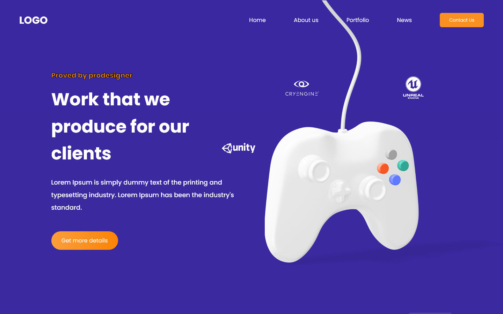

# Compass UOL - First Challenge

Este projeto envolveu a criação de duas landing pages, com o intuito de por em prática técnicas de HTML, CSS & JavaScript.

## Header & Footer

- **Header**
    - The Header should be on both pages, containing the 'LOGO' and all the links as in the figma (Home/About us/Portfolio/News/Contact us);
    - The 'Home' button should go to the first page and the 'Contact us' button should go to the second page, the other buttons should go to the error page (explained in the mandatory requirements).
- **Footer**
    - The Footer should be on both pages, with a design faithful to Figma; 
    - The 'Facebook', 'Instagram', 'Twitter' and 'LinkedIn' icons should be clickable, leading to the homepage of each social network;
    - The Footer link for 'Contact us' should go to the second page, the other buttons should go to the error page.

## Form Validation Requirements

1. **Disable "Send Message" Button**: The "Send Message" button must be disabled if any of the form fields are not filled in.

2. **Name Input Validation**: The name input cannot contain special characters or numbers.

3. **Email Input Validation**: The email input field must be validated using regular expressions to ensure that it contains a valid email address format.

4. **Message Input Validation**: The message input field must contain at least 20 letters.

5. **Success Page**: When submitting the form, go to the success page with the information that has been filled in.

## Preview

